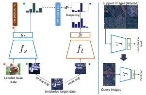

# Dynamic Distillation Network for Cross-Domain Few-Shot Recognition with Unlabeled Data

Pytorch implementation of NeurIPS 2021 paper *Dynamic Distillation Network for Cross-Domain Few-Shot Recognition with Unlabeled Data*.

[](https://arxiv.org/abs/2103.13517)
[](assets/NeurIPS_2021_poster.png)
[](assets/NeurIPS2021_slides.pdf)

<div align="center">    



</div>

## Prerequisite

Install the required python packages by:

```bash
pip install -r requirements.txt
```

## Dataset

Download the datasets from [here](https://drive.google.com/drive/folders/1X7WacUWKjZpjR2qo0gvaPY6dxkqtjGtz?usp=sharing), and keep them in the `data/` directory.

## Pretraining

Download the cross-entropy pretrained model (download from [here](https://drive.google.com/drive/folders/1T6QzEnAnbw4-FljldU03YJ84RZUfWhjm?usp=sharing)) on mini-ImageNet in `ckpt/ce_miniImageNet_resnet10`.

Or, train by running:

```bash
python main.py system=ce  backbone=resnet10 data.dataset=miniImageNet_train  model_name=ce_miniImageNet_resnet10 trainer.gpus=4
```

## Training

To train on mini-ImageNet and unlabeled target images, run the following command:

```bash
python main.py system=ce_distill_ema_sgd trainer.gpus=1 backbone=resnet10 \
  data.val_dataset=EuroSAT_test data.test_dataset=null print_val=false \
  trainer.log_every_n_steps=-1 \
  unlabel_params.dataset=EuroSAT_train data.num_episodes=600 \
  trainer.progress_bar_refresh_rate=0 print_val=false launcher.gpus=1\
  model_name=dynamic_cdfsl_EuroSAT
```

Change `EuroSAT` to other dataset to train on `CropDisese`, `ChestX`, `ISIC`.

Model will be saved in `ckpt/dynamic_cdfsl_EuroSAT/last.ckpt`

## Pretrained checkpoints

You can download the pretrained checkpoints on the BSCD-FSL benchmark datasets from [here](https://drive.google.com/drive/folders/1uFuSDL_vo2DJHLPqNS7R_iWuOzLazpc6?usp=sharing).

## Few-shot evaluation

For 5-way 5-shot evaluation on EuroSAT dataset:

```bash
python main.py system=few_shot  data.test_dataset=EuroSAT_test  ckpt=[pretrained-checkpoint]
```

## Citation

If you find this repo useful for your research, please consider citing the paper:

```none
@inproceedings{
islam2021dynamic,
title={Dynamic Distillation Network for Cross-Domain Few-Shot Recognition with Unlabeled Data},
author={Ashraful Islam and Chun-Fu Chen and Rameswar Panda and Leonid Karlinsky and Rogerio Feris and Richard Radke},
booktitle={Thirty-Fifth Conference on Neural Information Processing Systems},
year={2021},
url={https://openreview.net/forum?id=_4VxORHq-0g}
}
```

## Acknowledgement

- [cdfsl-benchmark](https://github.com/IBM/cdfsl-benchmark)
